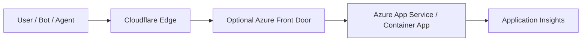

# From Edge to Backend Demo (Cloudflare vor Azure)

Dieses Repository liefert reproduzierbare Demo-Codebasis für drei Live-Demos:
- Demo 1: Security Funnel (block before Azure)
- Demo 2: AI Crawler Governance
- Demo 3: Cache Hit vs Origin Hit

## Architektur



Azure Front Door ist optional und nicht zwingend für die Demos.

## Repository-Struktur

```text
edge-before-azure-demo/
├── README.md
├── src/EdgeBeforeAzure.Api/
├── tests/EdgeBeforeAzure.Api.Tests/
├── scripts/
├── infra/azure/
├── infra/cloudflare/
├── .github/workflows/
└── docs/
```

## Lokal starten

```bash
dotnet restore EdgeBeforeAzure.slnx
dotnet run --project src/EdgeBeforeAzure.Api/EdgeBeforeAzure.Api.csproj
```

Smoke tests:
```bash
curl http://localhost:5000/
curl http://localhost:5000/api/weather
curl -A "GPTBot" http://localhost:5000/api/crawler-check
curl -w "\nTotal: %{time_total}s\n" http://localhost:5000/api/products
curl http://localhost:5000/api/health
```

## Azure Deployment (Terraform)

```bash
cd infra/azure
terraform init
terraform apply
```

Provisioniert:
- Resource Group
- App Service Plan
- Linux Web App
- Log Analytics Workspace
- Application Insights

## Cloudflare Konfiguration (Terraform)

```bash
cd infra/cloudflare
terraform init
terraform apply \
  -var cloudflare_api_token=... \
  -var cloudflare_zone_id=... \
  -var cloudflare_account_id=... \
  -var demo_hostname=demo.example.com \
  -var azure_origin_hostname=<azure-app-hostname>
```

Optionale Regeln sind per Terraform-Variablen aktivierbar:
- Demo 1 Header/User-Agent Block
- Demo 2 AI Bot Block + Scraper Challenge
- Demo 3 Cache Rule auf `/api/products`

## Demo 1 – Schritt für Schritt
1. `./scripts/load-demo-1.sh <base-url> normal`
2. `./scripts/load-demo-1.sh <base-url> suspicious`
3. Cloudflare Block-Regel aktivieren.
4. `suspicious` erneut ausführen und reduzierte Origin-Requests zeigen.
Siehe `docs/demo-1-security.md`.

## Demo 2 – Schritt für Schritt
1. `./scripts/crawler-demo-2.sh <base-url>`
2. Lokale Kategorisierung zeigen.
3. Cloudflare AI-Bot-Regeln aktivieren.
4. Script erneut ausführen und `edge-blocked` zeigen.
Siehe `docs/demo-2-ai-crawlers.md`.

## Demo 3 – Schritt für Schritt
1. Delay auf 500ms lassen (`Demo__ProductsDelayMilliseconds=500`).
2. `./scripts/cache-demo-3.sh <base-url>` ausführen.
3. Cloudflare Cache-Regel aktivieren.
4. Script erneut ausführen und `MISS` -> `HIT` zeigen.
Siehe `docs/demo-3-cache.md`.

## GitHub Actions
- `build.yml`: Restore, Build, Test, Publish Artifact auf PR und Push nach `main`.
- `deploy_azure.yml`: Manuelles Deployment (`workflow_dispatch`) der Azure-Ressourcen per Terraform.
- `deploy_cloudflare.yml`: Manuelles Deployment (`workflow_dispatch`) für Azure, optional Cloudflare.

Benötigte Secrets:
- `AZURE_CREDENTIALS`
- `CLOUDFLARE_API_TOKEN`
- `CLOUDFLARE_ZONE_ID`
- `CLOUDFLARE_ACCOUNT_ID`

## Troubleshooting
Siehe `docs/troubleshooting.md`.

## Cleanup
- Azure: `cd infra/azure && terraform destroy`
- Cloudflare: `cd infra/cloudflare && terraform destroy`
- Cache zurücksetzen: Cloudflare Cache Purge oder `./scripts/reset-demo-state.sh <base-url>`

## Environment Variables
- `ASPNETCORE_ENVIRONMENT`
- `APPLICATIONINSIGHTS_CONNECTION_STRING`
- `Demo__ProductsDelayMilliseconds`
- `DEMO_BASE_URL`
